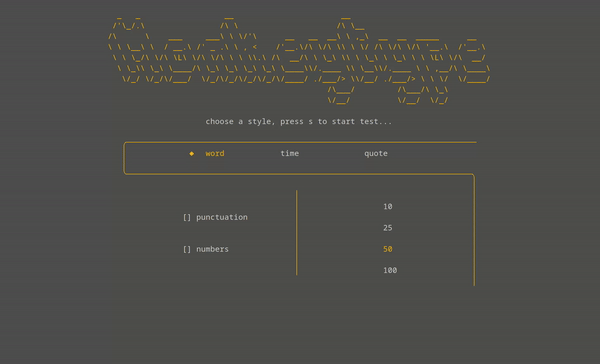

# MonkeyType CLI
A CLI implementation of the popular typing test website for geeks who prefer to practice in the terminal!




## Installation


### Download the Binary

Visit the [Releases](https://github.com/ZutrixPog/monkeytype/releases) page to download the latest version of the binary for your operating system.

- [Download Release](https://github.com/ZutrixPog/monkeytype/releases)

### Extract the Archive

After downloading, extract the contents of the archive. You can use the following commands in your terminal:

```bash
# For tar.gz archives
tar -xzf  monkeytype_Linux_x86_64.tar.gz

# For zip archives
unzip monkeytype_Windows_x86_64.zip  
```

### Optional: Move to System PATH
Optionally, you can move the extracted binary to a directory included in your system's PATH, allowing you to run the tool from any location in the terminal.

```bash
# Example: Move to /usr/local/bin on Unix-like systems
sudo mv monkeytype /usr/local/bin/
```
